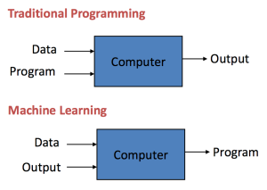
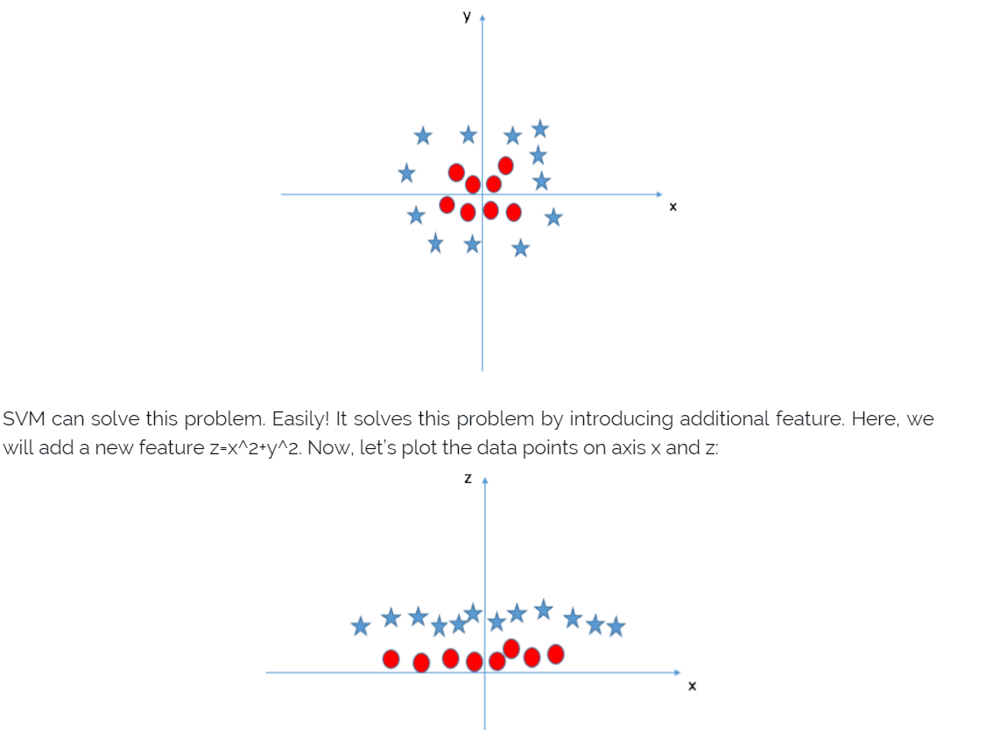

INFO 490: Advanced Data Science
===========

## Week 1: Introduction to Machine Learning

### Lesson 1: Intro to Machine Learning

- Iris Data and classification problem
    - two convenience plotting functions
        - confusion matrix (e.g. heatmap of 2d histogram using prediction and test data)
        - scatter plot (e.g. pair grid)
    - preprocessing of data
        - since sklearn does not support Pandas DataFrames, we need to extract data as numpy arrays
        - we need to use `cross_validation` module to create training and testing datasets
    - several learning algorithms
        - k-nearest neighbors
        - support vector machine
        - decision trees
        - random forest
            - an example of **emsemble learning**
            - combine decisions of a set of decision trees to make the final decision
    - cross-validation
        - repeatedly select **different training/validation datasets**, and get statistical measure of the performance of a specific algorithm
    - dimensionality reduction
        - PCA
    - clustering
        - k-means

- reading: basic concepts in machine learning
    - ref: http://machinelearningmastery.com/basic-concepts-in-machine-learning/
    - what is machine learning
        - traditional programming vs machine learning
            - 
        - key elements of machine learning
            - representation
            - evaluation
            - optimization
    - types of machine learning
        - supervised learning
        - unsupervised learning
        - semi-supervised learning
        - reinforcement learning
    - inductive learning
        - definition: given input samples {x} and output samples {f(x)}, the problem is to estimate the function f
        - it is the general theory behind supervised learning
    - some terminology
        - training sample, target function, hypothesis, concept, classifier, learner, hypothesis space, version space

- reading: a few useful things to know about machine learning
    - ref: http://homes.cs.washington.edu/~pedrod/papers/cacm12.pdf
    
### Lesson 2: Introduction to Machine Learning Pre-processing

- preprocessing includes
    - get basic info of data: `describe()`
    - drop and replace missing data: `dropna()`, `fillna()`
    - converting data to type "category" if necessary (convenient to group similar data)
    - convert datetime format using `to_datetime()`

- reading: data, learning and modeling
    - ref: http://machinelearningmastery.com/data-learning-and-modeling/
    - terminology of data
        - instance, feature, data type, datasets, training dataset, testing dataset 
    - terminology of learning
        - induction, generalization, over/under-learning, online/offline learning, supervised/unsupervised learning
    - terminology of modeling
        - model selection, inductive bias, model variance, bias-variance tradeoff

- reading: The Quartz guide to bad data
    - ref: https://github.com/Quartz/bad-data-guide

- reading: Rescaling Data for Machine Learning in Python with Scikit-Learn
    - ref: http://machinelearningmastery.com/rescaling-data-for-machine-learning-in-python-with-scikit-learn/

### Lesson 3: Introduction to Regression

- polynomial fitting
    - `polyfit`
    - overfitting issue
    - pros and cons
        - pros
            - straightforward, easy to use
        - cons
            - using **fixed criterion** and less flexible

- linear regression (LR)
    - LR with `statsmodels`
        - `statsmodels` is a Python library that implements a number of statistical methodology, often in concert with Pandas.
        - basic idea
            - use [**formula language** (defined in `statsmodels.formula.api`)](https://patsy.readthedocs.org/en/latest/formulas.html) to construct model, and pass in training data
                - an example of formula language
                ```Python
                result_noi = smf.ols(formula='y ~ x - 1', data=df).fit()  # "- 1" means no intercept
                ```
            - use `summary()` to see the fitting information (e.g. R-squared, Method, Model, std error, etc)
    - LR with `sklearn`
        - `sklearn` includes lots of different estimators, e.g. Ridge Regression, Lasso, Elastic Net, Orthogonal Matching Pursuit, Bayesian regression, Stochastic Gradient Descent, Robust regression, etc
        - basic idea
            - use `sklearn.linear_model.LinearRegression` to fit data, and use `train_test_split` to do cross-validation
    - ref: http://nbviewer.jupyter.org/urls/s3.amazonaws.com/datarobotblog/notebooks/ordinary_least_squares_in_python.ipynb


## Week 2: General Linear Models

### Lesson 1: Introduction to Multiple Variable Linear Regression

- multiple variable linear regression
    - the difference from single-variable case is to include more variable in the formula language (all other analysis is similar), e.g. 
    ```Python
    result = smf.ols(formula='aDelay ~ dDelay + dTime + np.sqrt(Distance)', data=local).fit()
    ```
    - note 
        - we could use function of a variable to fit the model, such as `np.sqrt(Distance)` in this case
        - we could also handle categorical variables, using notation `C()`, e.g.
        ```Python
        est = smf.ols(formula='chd ~ C(famhist)', data=df).fit()
        ```
        - to study interaction, we can use operator `*` (interaction term with linear terms) or `:` (interaction term only), e.g.
        ```Python
        est = smf.ols(formula='mdvis ~ hlthp * logincome', data=df).fit()
        ```

- reading: assumptions of multiple linear regression
    - ref: http://www.statisticssolutions.com/assumptions-of-multiple-linear-regression/
    - check assumptions using graphs
        - basic idea: plot residues against fitted values, plot residuals
        - ref: section 8.3 of this: https://www.openintro.org/download.php?file=os2_08&referrer=/stat/textbook/textbook_os2_chapters.php

- reading: linear regression with Python
    - ref: http://connor-johnson.com/2014/02/18/linear-regression-with-python/
    - this material covers most information given by `result.summary()`

- reading: multiple regression in Python
    - ref: http://nbviewer.jupyter.org/urls/s3.amazonaws.com/datarobotblog/notebooks/multiple_regression_in_python.ipynb

### Lesson 2: Introduction to Regularization

- example: polynomial fitting
    - firstly we use `PolynomialFeatures()` to transform data x into polynomial terms (1, x, x^2, x^3, ...) and then pass these terms into `LinearRegression()` to do fitting.  These two steps (transformation and fitting) can be pipelined using `make_pipeline()` function, see more info here: http://scikit-learn.org/stable/tutorial/statistical_inference/putting_together.html
        - code example
        ```Python
        for idx, deg in enumerate(range(1, max_deg + 1)):
            est = make_pipeline(PolynomialFeatures(deg), LinearRegression())  
            # what this pipeline does is: transform the input (1D data) into corresponding polynomial terms (1, x, x^2, etc)
            # and then pass the terms into LinearRegression() to do fitting
            est.fit(x_train[:, np.newaxis], y_train)

            plt.plot(xf, est.predict(xf[:, np.newaxis]), c=cmp[deg - 1], label='{0} Order'.format(lbls[idx]))
        ```
    - by computing the MSE of the testing data, we can see the overfitting issue, and find the optimal fitting degree
    - regularization techniques
        - Ridge regression
            - basic idea: add L2 norm of regression coefficients as the penalty term
        - Lasso regularization
            - basic idea: add L1 norm of regression coefficients as the penalty term
            - due to the properties of L1 norm, many coefficients will become 0 at the optimal solution.  So Lasso typically gives a **sparse solution**
        - elastic net
            - basic idea: combine Ridge and Lasso
            - ref: https://en.wikipedia.org/wiki/Elastic_net_regularization#Specification

- reading: Understanding the Bias-Variance Tradeoff
    - ref: http://scott.fortmann-roe.com/docs/BiasVariance.html
    - definition
        - given a model, we get different functions for different training data.  
            - **bias**: the difference between the average prediction value (given by functions with different training data) and the expected value. 
            - **variance**: the difference among different predicted values (given by functions with different training data)
    - bias-variance tradeoff
        - 

### Lesson 3: Introduction to Logistic Regression

## Week 3: Introduction to Supervised Learning

### Lesson 1: k-Nearest Neighbors

- k-nearest neighbors
    - use `KNeighborsClassifier()`
        - by default, the distance function is [Minkowski distance](https://en.wikipedia.org/wiki/Minkowski_distance)
        - by default, each neighboring point has the same weight, you can modify that in `weights` parameter
        - ref: http://scikit-learn.org/stable/modules/generated/sklearn.neighbors.KNeighborsClassifier.html
    - model evaluation
        - use `seaborn.heatmap()` to visulize **confusion matrix**
        - use `sklearn.metrics.classification_report()` to generate a report about **precision, recall, and f1-score**
            - precision: true positives / (true positives + false positives)
            - recall: true positives / (true positives + false negatives)
            - ref
                - https://en.wikipedia.org/wiki/Precision_and_recall
                - https://en.wikipedia.org/wiki/F1_score

- reading: how to evaluate machine learning models: classification metrics
    - ref: http://blog.dato.com/how-to-evaluate-machine-learning-models-part-2a-classification-metrics
    - ways of measuring classification performance
        - accuracy: number of correct predictions / number of total data points
        - per-class accuracy: average of accuracies of all classes
        - confusion matrix
        - log-loss: deals with probability values, similar to information entropy
        - AUC (Area Under the Curve)
            - the curve here is [receiver operating characteristic curce](https://en.wikipedia.org/wiki/Receiver_operating_characteristic), which illustrates the performance of a binary classifier system as its **discrimination threshold** is varied, by plotting **true positive rate (TPR)** vs. **false positive rate (FPR)**
                - note
                    - it only works for **binary classifier** system, does not work for multiple classes, how do we use it for multiple classes? one way is to use `sklearn.preprocessing.label_binarize()` to binarize the classification labels, read this: http://scikit-learn.org/stable/modules/generated/sklearn.preprocessing.binarize.html
                    - how do we determine whether an item belongs to a positive or a negative class? by comparing the score (calculated using input) with a threshold value.  If it is greater than threshold, then positive
                    - each data point on ROC curve corresponds to a threshold value
                    - as the threshold value increases, both TPR and FPR will increase

- reading: how to evaluate machine learning models: ranking and regression metrics
    - ref: http://blog.dato.com/how-to-evaluate-machine-learning-models-part-2b-ranking-and-regression-metrics
    - ranking metrics
        - precision-recall and f1-score
        - NDCG
            - main idea: assign different weights to different items (unulike precision-recall where we assign equal weights to all items)
    - regression metrics
        - RMSE
        - quantiles of errors
            - e.g. median or 90th percentile of absolute percent error
        - "almost correct" predictions
            - the percent of estimates that differ from the true value by no more than X%

### Lesson 2: Support Vector Machine

- introduction to SVM
    - three types of classifiers related to SVM
        - maximal margin classifier (MMC)
            - basic idea: use a hyperplane to segregate two classes, to maximize **margin**
            - constructing MMC
            
            - **support vectors** are those that affect the boundary lines, in this case, the support vectors are points located exactly on the edge of the margin
        - support vector classifier (SVC)
            - motivation: relax the requirement that a separating hyperplane will perfectly separate every training observation on the correct side of the line, using what is called a **soft margin** 
            - constructing SVC
            
        - support vector machine (SVM)
            - motivation: how to deal with non-linear decision boundaries?
                - one way is to construct additional non-linear features from existing features, as we did in linear regression, an example is give below
                    - the problem with this method is it can be quite **computationally expensive**
                    
                - another way is the **kernel trick**
                    - kernel trick is based on the fact that the SVC classifier **only depends on inner products** of observations, not observations themselves, the classifier could be written as $f(x)=\beta_0+\sum_{i=1}^n {\alpha_i \langle x,x_i \rangle}$
                    - we can see inner product as the **similarity function**, and we can replace this with another kernel function $K(x_i, x_k)$, one example is radial kernel, which decays exponentially with the distance, so it has **extremely localized behavior**, see [here](https://www.quantstart.com/articles/Support-Vector-Machines-A-Guide-for-Beginners)
                    - kernel trick is much more efficient than adding features approach
    - ref
        - https://www.quantstart.com/articles/Support-Vector-Machines-A-Guide-for-Beginners
        - Chapter 9 of Introduction to Statistical Learning
        - http://www.analyticsvidhya.com/blog/2015/10/understaing-support-vector-machine-example-code/

### Lesson 3: Naive Bayes

- reading: sklearn documentation of Naive Bayes algorithm
    - ref: http://scikit-learn.org/stable/modules/naive_bayes.html
    - this is a very good resource for introduction to NB algorithm

- reading: 6 easy steps to learn Naive Bayes algorithm
    - ref: http://www.analyticsvidhya.com/blog/2015/09/naive-bayes-explained/
    - what is NB algorithm?
        - theory: $p(c|x) = p(x|c) p(c)/p(x)$
        - assumption: independence among predictors
        - it is particularly useful for **very large data sets**

## Week 4: Tree Algorithms and Ensemble Techniques

### Lesson 1: Decision Trees

- intro to decision trees
    - basic idea: construct a decision tree by **recursively splitting** a data set into new groupings based on a **statistical measure (e.g. histogram)** of the data along each different dimension 

- reading: A Visual Introduction to Machine Learning
    - ref: http://www.r2d3.us/visual-intro-to-machine-learning-part-1/
    - this is a very nice visualization to decision tree algorithm

### Lesson 2: Ensemble Techniques: Bagging

- random forest
    - basic idea: build a set of decision trees, and combine predictions from the different trees statistically to make a final prediction, it is an example of **bagging approach of ensemble learning**
        - **Bagging** means that when building each subsequent tree, we don’t look at the earlier trees, while in boosting we consider the earlier trees and strive to compensate for their weaknesses
        - ref: http://fastml.com/intro-to-random-forests/
    - steps
        - randomly divide data into several datasets, and train multiple decision trees
        - Each tree is grown to the largest extent possible and  there is no pruning
        - Predict new data by aggregating the predictions of the ntree trees (**majority votes for classification, average for regression**)
    - ref: http://www.analyticsvidhya.com/blog/2015/09/random-forest-algorithm-multiple-challenges/

### Lesson 3: Ensemble Techniques: Boosting

- 